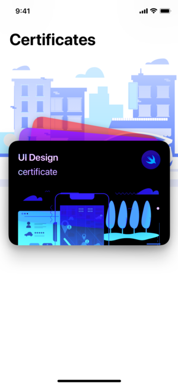
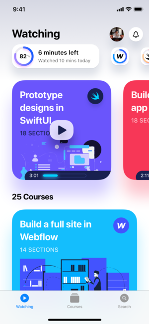
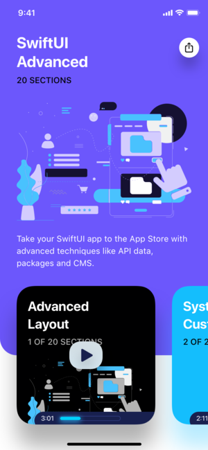

# SWIFT UI DEMO

## INTRODUCTION

SwiftUI was introduced with iOS 13.

instead of imperative UI, prior to iOS 13, SwiftUI is a user interface toolkit that lets us design apps in a declarative way.

This iOS project is all about using SwiftUI and learning new design trends.

Most techniques were learned from a course at https://designcode.io/

## PROJECT SCREENSHOTS

